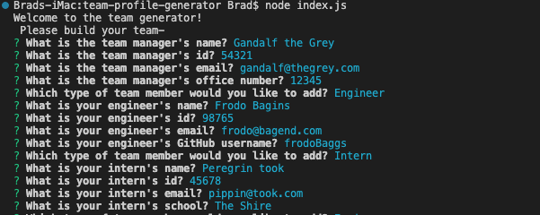
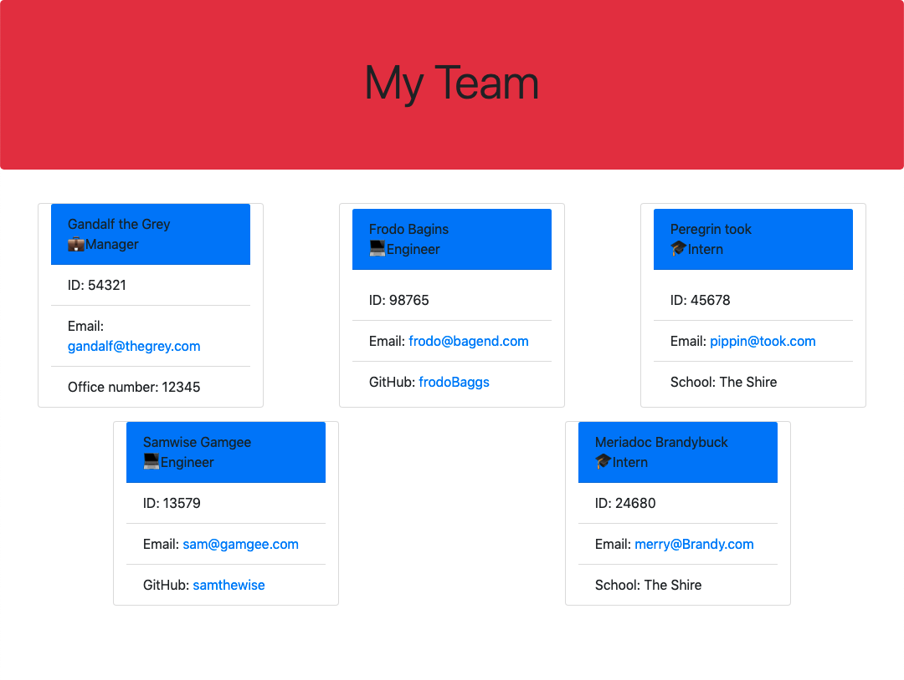

# team-profile-generator
  [](https://opensource.org/licenses/MIT)

  ## Description
  

  ## Table of Contents

  ♦︎[Installation](#installation)

  ♦︎[Usage](#usage)

  ♦︎[Contributing](#contributing)

  ♦︎[Tests](#tests)

  ♦︎[Questions](#questions)

  ## Installation

  To install the necessary dependencies, run the following command:

  ```
  npm i
  ```

  ## Usage

  After initializing the app as described above, the app can be launched using 

  ```
  node index.js
  ```

  The user will then be prompted to provide information about their team's manager including name, id, email, and office number. They will then be given the option to add an engineer, an intern, or to finish adding members. If the user chooses to add an engineer or intern they will be prompted to provide the individuals name, id, email and either their GitHub or University respectively, and again given the option to continue adding members.

   
  
  If the user chooses to finish adding members then an HTML file will be generated in the 'dist' folder with their team's information. The html file can then be opened in the user's browswer to see a styled webpage with working links to navigate to engineer's GitHubs or easily send emails.
  
  

  A walkthrough video can be found [here.](https://watch.screencastify.com/v/UZxktDS3xunG58rn0i71)
  

  ## License

  This project is licensed under the [MIT](https://opensource.org/licenses/MIT) license.

  ## Contributing

  

  ## Tests

  To run tests, run the following command:

  ```
  npm test
  ```

  ## Questions

  If you have any questions about the repo, open and issue or contact me directly at braddwagner@outlook.com. You can find more of my work on my [GitHub](https://github.com/braddwa